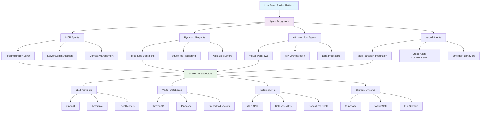
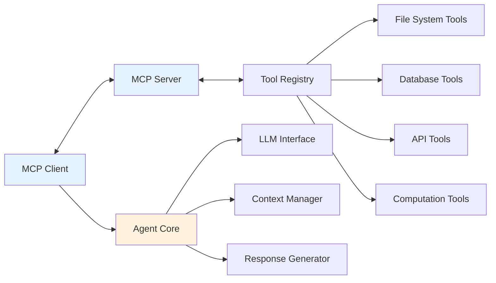
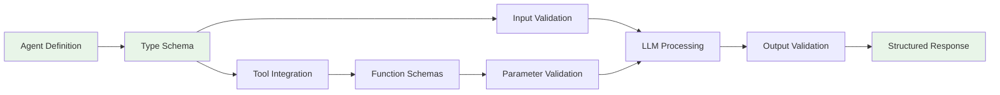
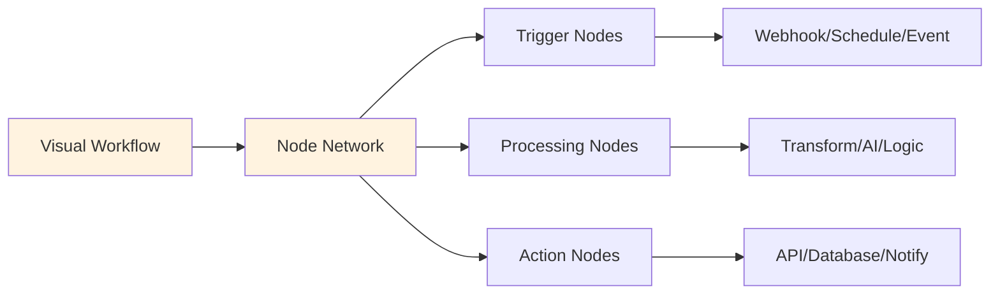
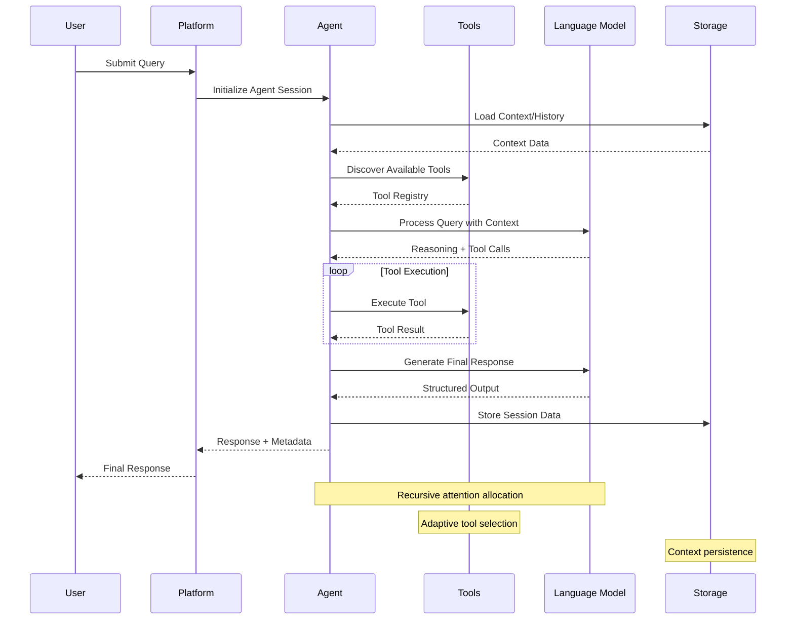
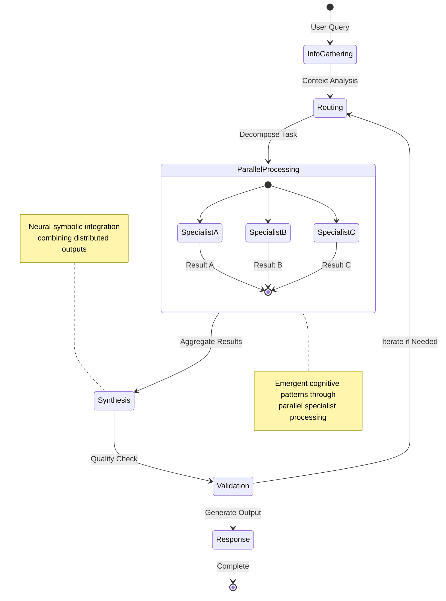
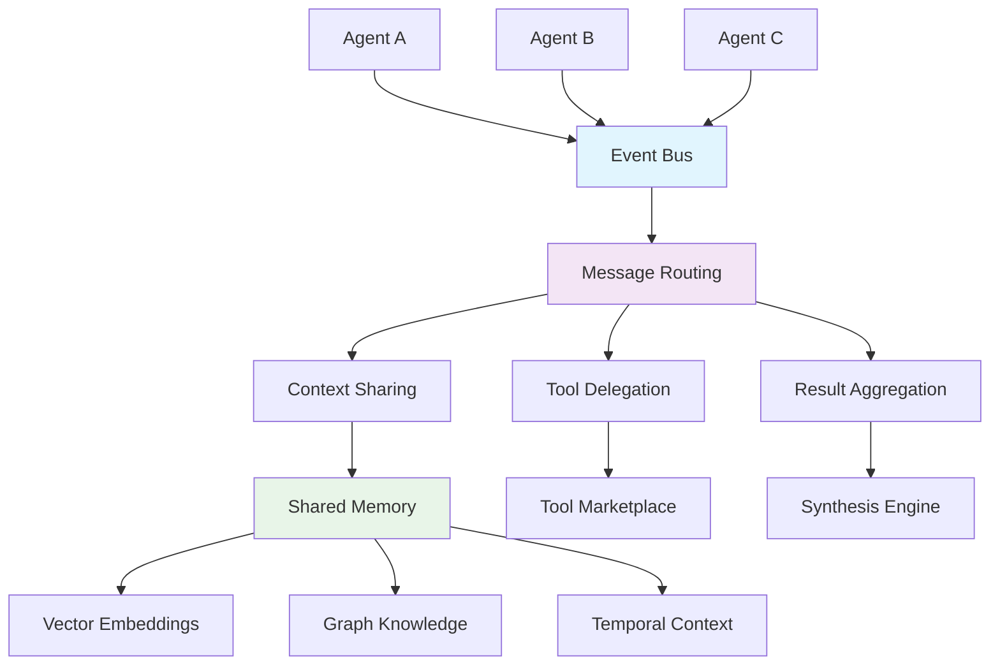

# oTTomator Agents: Comprehensive Architecture Documentation

## Overview

The oTTomator Agents ecosystem represents a distributed, multi-paradigm cognitive architecture that facilitates emergent AI agent behaviors through recursive pattern encoding and neural-symbolic integration. This documentation maps the implicit architectural patterns into explicit, actionable knowledge structures.

## Architectural Principles

### 1. Recursive System Mapping
The architecture follows hypergraph pattern encoding where each agent serves as both a computational node and a cognitive kernel capable of:
- **Autonomous Tool Integration**: Through MCP (Model Context Protocol) standardization
- **Structured Reasoning**: Via Pydantic AI type-safe agent definitions  
- **Multi-Agent Orchestration**: Using LangGraph for parallel cognitive workflows
- **Adaptive Attention Allocation**: Through dynamic tool selection and context management

### 2. Emergent Cognitive Patterns
Agent behaviors emerge from the intersection of:
- **Neural Processing**: LLM-based reasoning and generation
- **Symbolic Integration**: Structured data validation and tool schemas
- **Workflow Orchestration**: Graph-based agent communication patterns
- **Environmental Adaptation**: Docker containerization and platform integration

## High-Level System Architecture



## Agent Pattern Taxonomy

### MCP (Model Context Protocol) Agents
These agents implement standardized tool integration through the Model Context Protocol, enabling:



## Agent Implementation Examples

### MCP (Model Context Protocol) Agents

**Advanced Implementations:**
- **`thirdbrain-mcp-openai-agent`**: Sophisticated MCP integration with OpenAI models, tool discovery, and context management
- **`pydantic-ai-mcp-agent`**: Type-safe MCP agent combining protocol standardization with Pydantic validation
- **`simple-mcp-agent`**: Minimal MCP implementation demonstrating core protocol patterns
- **`mcp-agent-army`**: Multi-agent MCP orchestration with parallel tool execution

**Architecture Pattern:**


### Pydantic AI Agents

**Advanced Implementations:**
- **`pydantic-ai-langgraph-parallelization`**: Multi-agent orchestration with LangGraph for parallel cognitive workflows
- **`pydantic-ai-advanced-researcher`**: Research workflow automation with structured data validation
- **`pydantic-github-agent`**: GitHub API integration with comprehensive type safety
- **`pydantic-ai-langfuse`**: Observability and tracing integration for agent behavior analysis

**Architecture Pattern:**


### n8n Workflow Agents

**Advanced Implementations:**
- **`n8n-expert`**: Workflow recommendation and optimization using AI-powered analysis
- **`n8n-agentic-rag-agent`**: Retrieval-Augmented Generation implemented through visual workflows
- **`contextual-retrieval-n8n-agent`**: Advanced contextual retrieval patterns with workflow orchestration
- **`n8n-github-assistant`**: GitHub automation through visual workflow programming

**Architecture Pattern:**


### Specialized Agent Categories

**RAG (Retrieval-Augmented Generation) Agents:**
- `foundational-rag-agent`: Core RAG implementation patterns
- `light-rag-agent`: Lightweight retrieval mechanisms
- `r1-distill-rag`: Distilled reasoning with retrieval enhancement

**Data Processing Agents:**
- `crawl4AI-agent-v2`: Advanced web crawling with AI-powered content extraction
- `ottomarkdown-agent`: File processing and markdown conversion
- `multi-page-scraper-agent`: Distributed web content acquisition

**Domain-Specific Expert Agents:**
- `tech-stack-expert`: Technology recommendation and analysis
- `travel-agent`: Multi-modal travel planning and coordination
- `indoor-farming-agent`: Agricultural optimization and monitoring

## Repository Structure Mapping

The repository organization reflects the architectural principles:

```
ottomator-agents/
├── docs/                           # 🆕 Architecture documentation
├── ~sample-*-agent~/              # Reference implementations
├── *-mcp-*-agent/                 # MCP protocol agents
├── pydantic-ai-*/                 # Type-safe agents
├── n8n-*/                         # Workflow-based agents
├── *-rag-*/                       # Retrieval-augmented agents
├── crawl4AI-*/                    # Specialized data acquisition
└── *-expert/                      # Domain-specific agents
```

Each agent directory typically contains:
- `README.md`: Agent-specific documentation
- `requirements.txt`: Dependencies
- `Dockerfile`: Containerization
- `.env.example`: Configuration template
- Agent implementation files
- Optional: `/docs` for detailed diagrams

### Navigation Guide

**For Contributors:**
- Review the [architecture documentation](docs/architecture.md) to understand system patterns
- Study [agent patterns](docs/agent-patterns.mmd) to choose the right implementation approach
- Follow [cognitive integration](docs/cognitive-integration.mmd) principles for cross-agent communication

**For Agent Developers:**
- Use `~sample-*-agent~` directories as starting templates
- Reference existing implementations in the same pattern category
- Add agent-specific diagrams following the established Mermaid patterns

**For System Architects:**
- Examine [system overview](docs/system-overview.mmd) for high-level relationships
- Study [multi-agent orchestration](docs/multi-agent-orchestration.mmd) for coordination patterns
- Consider emergent properties when designing new agent interactions

## Data Flow and Signal Propagation

### Agent Lifecycle Sequence



### Multi-Agent Orchestration Pattern



## Integration Patterns and Cognitive Synergies

### Cross-Agent Communication
Agents communicate through standardized interfaces enabling emergent behaviors:



### Adaptive Attention Allocation

The architecture implements dynamic attention mechanisms through:

1. **Context-Aware Tool Selection**: Agents select tools based on query analysis and available context
2. **Recursive Pattern Recognition**: Agents identify and reuse successful interaction patterns  
3. **Emergent Workflow Optimization**: Multi-agent systems self-optimize through experience
4. **Cognitive Load Balancing**: Workload distribution across specialist agents

### Neural-Symbolic Integration Points

Critical integration occurs at:

- **Type System Boundaries**: Where Pydantic schemas meet LLM outputs
- **Tool Interface Layers**: MCP protocol bridging symbolic tools with neural reasoning
- **Workflow Orchestration**: LangGraph state management combining symbolic graphs with neural decisions
- **Knowledge Representation**: Vector embeddings encoding symbolic knowledge for neural retrieval

## Repository Structure Mapping

The repository organization reflects the architectural principles:

```
ottomator-agents/
├── docs/                           # Architecture documentation
├── ~sample-*-agent~/              # Reference implementations
├── *-mcp-*-agent/                 # MCP protocol agents
├── pydantic-ai-*/                 # Type-safe agents
├── n8n-*/                         # Workflow-based agents
├── *-rag-*/                       # Retrieval-augmented agents
├── crawl4AI-*/                    # Specialized data acquisition
└── *-expert/                      # Domain-specific agents
```

Each agent directory typically contains:
- `README.md`: Agent-specific documentation
- `requirements.txt`: Dependencies
- `Dockerfile`: Containerization
- `.env.example`: Configuration template
- Agent implementation files
- Optional: `/docs` for detailed diagrams

## Emergent Properties and Future Directions

### Current Emergent Behaviors
- **Cross-Modal Learning**: Agents learning from diverse interaction patterns
- **Tool Ecosystem Evolution**: New tools emerging from agent requirements
- **Workflow Pattern Emergence**: Reusable patterns crystallizing from successful executions

### Cognitive Optimization Vectors
- **Hypergraph Pattern Encoding**: Enhanced relationship modeling between agents
- **Recursive Self-Improvement**: Agents optimizing their own performance metrics
- **Distributed Cognition Scaling**: Seamless addition of new agent types and capabilities

### Adaptive Documentation Framework
This documentation represents a living system that evolves with the architecture:
- **Feedback Loop Integration**: Documentation updates based on usage patterns
- **Pattern Discovery**: Automatic identification of new architectural patterns
- **Cognitive Map Expansion**: Dynamic diagram generation as new relationships emerge

---

*This architecture documentation captures the current state of the oTTomator Agents ecosystem while providing a framework for understanding and extending its emergent cognitive capabilities.*